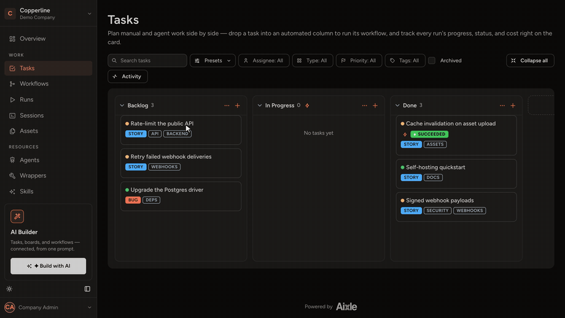

# Aixle Flow

**The team-level control plane for AI coding agents.**
Put a card on the board, an agent picks it up in an isolated container,
your team sees the run, the cost, and the output — without anyone
opening a terminal.

[](LICENSE)
[](https://rubyonrails.org/)
[](https://react.dev/)
[](ROADMAP.md)



## Why Aixle Flow

Cursor and Claude Code are personal superpowers. They run on **your**
laptop, in **your** terminal, for **your** task. Once more than one
person on a team starts delegating work to agents, the wheels come off:

- Nobody knows what's running, where, or whether it's stuck.
- There's no shared trail of what an agent did or how much it cost.
- Setup is per-developer, so the team uses agents five different ways.

Aixle Flow is the layer above the agent — the Kanban board, the workflow
graph, the audit log, the cost meter. The agent stays great at coding;
Aixle Flow makes it usable by a team.

It is the only open platform we know of that combines:

- A **board** with column → workflow bindings (drop a card, trigger a run)
- A **DAG workflow engine** with retries, approval gates, and parallel steps
- **Container-isolated** agent execution (Claude Code, Cursor CLI, Codex, Gemini CLI)
- **MCP-native** tool integration
- **Per-session cost tracking** in tokens and cents
- **Temporal** under the hood for durable, long-running runs

## Quickstart

Three commands to a working app on `http://localhost:4000`.

```bash
git clone https://github.com/AixleHQ/flow.git && cd flow
cp .env.example .env.development   # fill in OAuth secrets if you want SSO
make setup                          # builds containers, installs deps, seeds DB
```

Then in two terminals:

```bash
make up       # terminal 1 — web, db, redis, traefik, temporal
make worker   # terminal 2 — Temporal worker
```

Open `http://localhost:4000` and sign in.

> **5-minute setup is on the roadmap.** Right now `make setup` builds
> agent images which takes longer the first time. See
> [`ROADMAP.md`](ROADMAP.md) for the planned `docker compose up`
> single-command flow.

Need more detail? See [docs/quickstart.md](docs/quickstart.md).

## Documentation

Three tiers, each independently navigable:

| Tier         | For                            | Where                                       |
| ------------ | ------------------------------ | ------------------------------------------- |
| **Quickstart** | First-time users, < 5 min    | [docs/quickstart.md](docs/quickstart.md)    |
| **User Guide** | Common workflows & gotchas   | [docs/user-guide/](docs/user-guide/)        |
| **Reference**  | Full API / CLI / config surface | [docs/reference/](docs/reference/)       |

## Roadmap

What's planned and what's in flight — see [ROADMAP.md](ROADMAP.md).
Issues tagged [`good first issue`][gfi] are a good place to start
contributing.

[gfi]: https://github.com/AixleHQ/flow/issues?q=is%3Aissue+is%3Aopen+label%3A%22good+first+issue%22

## Tech Stack

- **Backend** — Ruby on Rails 8, PostgreSQL, Redis, Temporal
- **Frontend** — React 19, Inertia.js, Mantine 9, Vite, TypeScript
- **Agents** — Claude Code, Cursor CLI, OpenAI Codex CLI, Gemini CLI
  (each runs in its own Docker container)
- **Protocols** — MCP for tools, ActionCable for live updates
- **Dev environment** — Docker Compose, one Makefile

## Inspired by

Aixle Flow stands on the shoulders of the open agent-and-workflow
ecosystem. A few projects shaped how we think:

- **[n8n](https://n8n.io)** — workflow automation can be open,
  code-friendly, and priced per run rather than per step.
- **[Dify](https://dify.ai)** and **[Langflow](https://www.langflow.org)**
  — visual, open-source orchestration of LLM agents and pipelines.
- **Paperclip** — treating a roster of agents like an org, with budgets,
  governance, and per-agent cost as first-class concerns.
- **[Cursor](https://www.cursor.com)** — background agents that run in
  isolation and are triggered by events, not just a human at a keyboard.
- **[Temporal](https://temporal.io)** — durable execution as the right
  foundation for long-running, retryable agent runs.
- **[Model Context Protocol](https://modelcontextprotocol.io)** — an open
  standard for giving agents tools.
- The **[Kanban board](https://en.wikipedia.org/wiki/Kanban_board)** — work
  lives in columns anyone on the team can move.

Where each inspired a category, Aixle Flow's own contribution is to make it
**board-native and team-first**: drop a card, an agent runs in a container,
and the whole team sees the run, the trail, and the cost.

## Contributing

We welcome PRs, issues, and discussion.

1. Read [CONTRIBUTING.md](CONTRIBUTING.md).
2. Pick up a [`good first issue`][gfi] or open a discussion before
   starting on something larger.
3. Run `make check` before opening a PR.

## License

Aixle Flow is released under the [Apache License 2.0](LICENSE) — a permissive
license that lets you use, modify, self-host, and commercially deploy it freely,
including in closed-source products, as long as you preserve the license and
attribution notices.

See [`LICENSE`](LICENSE) for the full terms, [`NOTICE`](NOTICE) for attribution,
and [`THIRD-PARTY-LICENSES.md`](THIRD-PARTY-LICENSES.md) for the licenses of
bundled dependencies. "Aixle" and "Aixle Flow" are trademarks — see
[`TRADEMARK.md`](TRADEMARK.md).

Contributions are accepted under the Apache 2.0 license and require both a
Developer Certificate of Origin (DCO) sign-off and a signed Contributor License
Agreement (CLA) — see [`CONTRIBUTING.md`](CONTRIBUTING.md).
